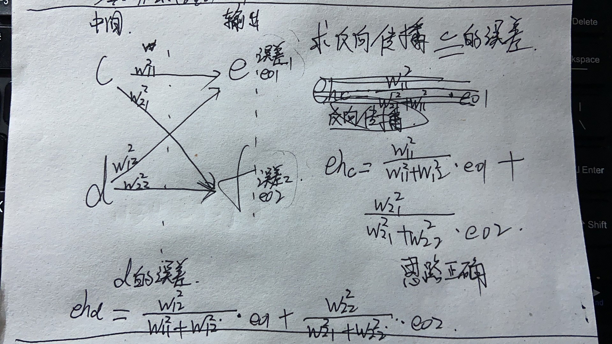

# Thinking1	什么是反向传播中的链式法则 #

答：这是我自己推导的过程。

链式法则个人的理解就是通过每次计算得出的输出层的预测结果和原结果得出误差值，然后根据隐藏层的权重和结果层的误差值，算出隐藏层的误差值，然后根据这个误差值调整权重然后重新进行计算。如此反复，最终得到优化的目的。
据图可得，e的误差值由c，d两部分的误差之和。f的误差也同理。所以反过来求c的误差值，需要根据权重进行加权计算得出c的误差值。c的误差值也同理由两部分组成，一部分是导致了e的误差值，值为w11/w11+w12 * eo1  。还有一部分为导致了f的误差值，值为 w21/w21+w22 * eo2   。所以c的误差值为两部分之和。

# Thinking2	请列举几种常见的激活函数，激活函数有什么作用 #

答：常见的有sigmoid，tanh，Relu
神经网络主要由两部分组成，一部分是线性结构  wx+b ，另一部分就是激活函数。激活函数能够把线性的结构转换为非线性的，而这种非线性使得我们能够学习到输入与输出之间任意复杂的变换关系。

# Thinking3	利用梯度下降法训练神经网络，发现模型loss不变，可能有哪些问题？怎么解决？ #

答：最大的影响的可能性就是梯度消失。在sigmoid函数中，如果要更新隐藏层的权重，就需要求出损失函数对于权重的导数，但是因为神经网络的参数采用随机初始化的方法，取值往往会小于1，这就会导致随着神经网络层数的深入，梯度会越来越小甚至趋于0.就产生了梯度消失。导致隐藏层的权重也不会再更新。
解决办法就是换成relu的激活函数，ReLU函数的导数，在正值部分恒为1，因此不会导致梯度消失或梯度爆炸问题。

